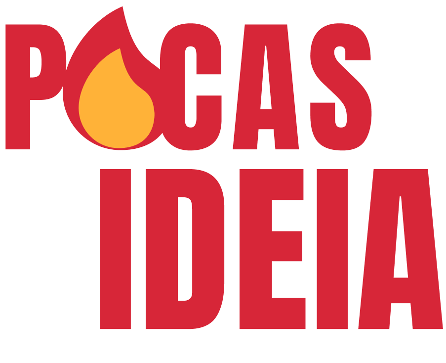
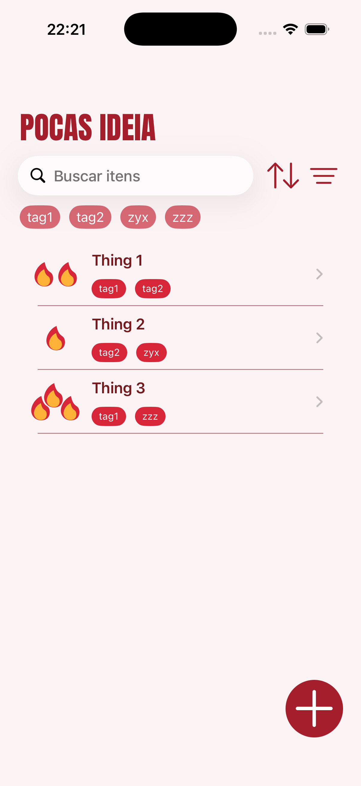
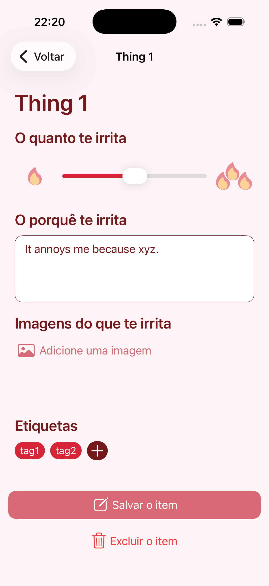
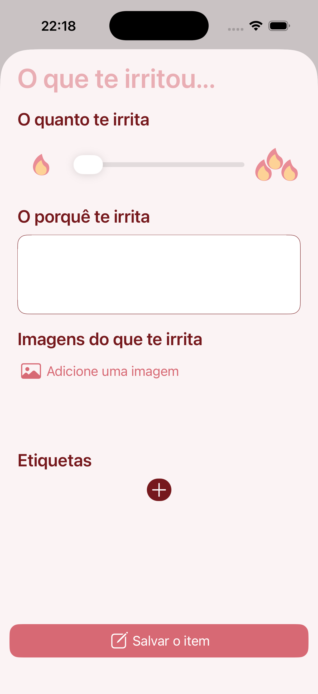
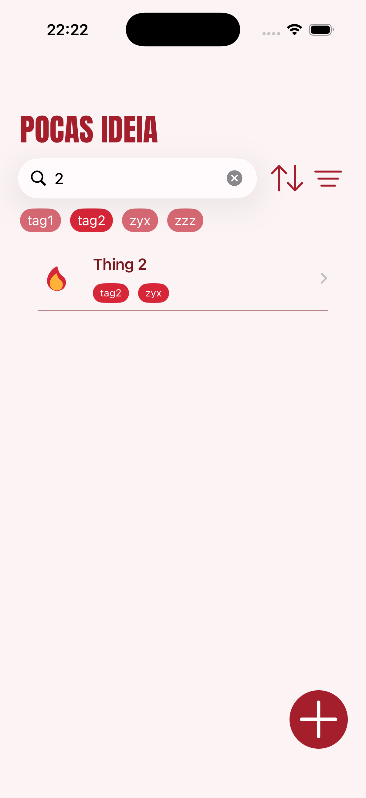
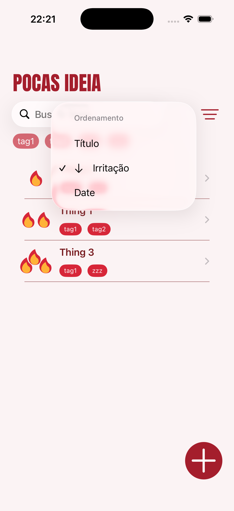
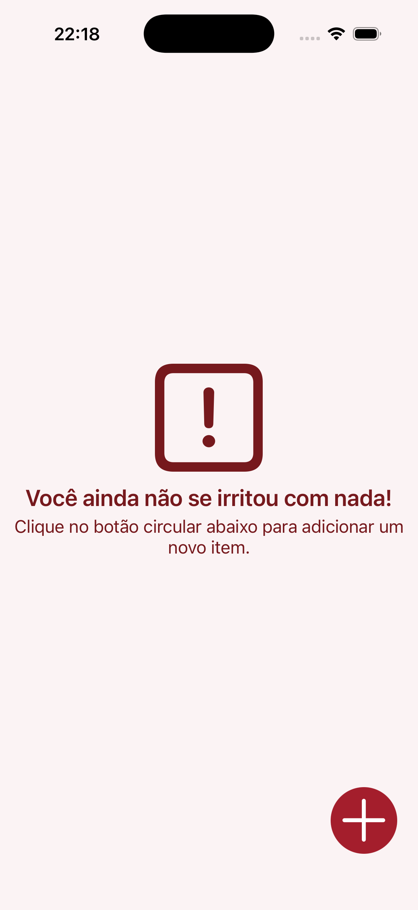

<h1 align="center">
    
</h1>

  <i align="center">Your personal space to <b>vent frustrations</b> safely</i>

  

  
  
  
  

## Introduction

PocasIdeia is an **iOS app** built with UIKit and SwiftData, created as a Nano Challenge at the Apple Developer Academy.

**Log your frustrations** — give each one a title, rate your irritation level on a slider, write a summary, attach up to 3 photos, and organize entries by custom tags. Everything stays on-device and private.

## Screenshots

Screenshots

 

    
&nbsp;
    
&nbsp;
    

    
&nbsp;
    
&nbsp;
    

## Development

- **Architecture & Patterns**: MVC with fully programmatic UIKit — no storyboards or XIBs. Views are composed in dedicated `UIView` subclasses and wired to controllers manually.
- **Frameworks**: SwiftData for local persistence with tag relationships; PhotosUI for multi-image selection (up to 3 per entry); `UINotificationFeedbackGenerator` for haptic feedback on interactions.
- **Data model**: Each entry stores a title, integer irritation level, free-text summary, raw image data, and a many-to-many tag relationship — all queried with SwiftData predicates for live search and tag filtering.

## Resources & Credits

- **Anton** (Google Fonts): Display typeface used for titles and irritation level indicators.
- **SF Symbols**: System icons for sort, filter, trash, and navigation controls.

## License

PocasIdeia is available under the [MIT License](./LICENSE).

The app is published on the [App Store](https://apps.apple.com/us/app/pocasideia/id6753698657).
